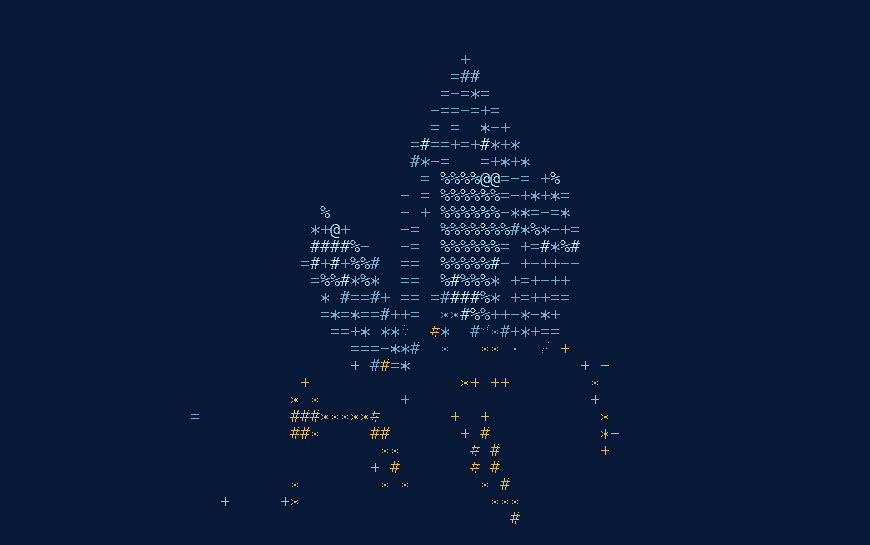

<div align="center">



<h1>ore</h1>

<p><em><strong>ore</strong>, n. (Mining) A native metal or its compound with the rock in<br />
which it occurs, after it has been picked over to throw out what is worthless.</em></p>

<p><sub>— Webster's Revised Unabridged Dictionary, 1913</sub></p>

</div>

---

A coding agent for the terminal. `ore` is a fork of
[OpenAI Codex](https://github.com/openai/codex) that tracks upstream's stable
releases. It keeps the agent and drops the telemetry.

Bring your own key: any endpoint that speaks the OpenAI Responses API can be
configured as a provider, exactly as in Codex — Ollama and LM Studio included.
Four wire protocols ship: the OpenAI Responses API, Chat Completions
(`wire_api = "chat"`, which upstream removed and this fork restored),
Anthropic's Messages API, and Gemini. Anthropic, Gemini, Ollama and LM Studio
are built-in providers; anything speaking one of those four wires works from a
`[model_providers.*]` table, and the picker lists what your gateway actually
serves rather than a fixed catalog.

## Install

ore is in prerelease, so install a pinned version:

```bash
curl -fsSL https://github.com/ore-cli/ore/releases/download/ore-v1.149.0/install.sh \
  | sh -s -- --release 1.149.0
```

macOS and Linux, Apple Silicon and x86_64. It installs `ore` into
`~/.local/bin`; set `CODEX_INSTALL_DIR` to put it somewhere else.

The shorter one-liner you would expect does not work yet, and neither does
Homebrew:

```bash
curl -fsSL https://github.com/ore-cli/ore/releases/latest/download/install.sh | sh
brew install ore-cli/tap/ore
```

Both resolve through `releases/latest`, which by GitHub's definition skips
prereleases -- the release workflow sets `make_latest=false` for any tag
carrying `-alpha`/`-beta`, because an alpha should not be what an unpinned
install silently gives you. The formula is published on stable tags only for
the same reason. Both commands start working with the first stable `ore-v1.149.x`
and are what this section will say then.

npm is not yet published: upstream's package layout requires binaries for every
platform including Windows, so `@ore-cli/ore` arrives with the first
Windows-complete release.

Or build it yourself:

```bash
git clone https://github.com/ore-cli/ore.git
cd ore/codex-rs
cargo build --release --bin codex
install -m 755 target/release/codex ~/.local/bin/ore
```

The cargo target is still named `codex` — the rename to `ore` happens at
packaging time, which is what lets upstream's tests and build graph run
unmodified.

## What changed

| Area         | Codex                                                                                                                                                                                  | ore                                                                                                                                                                                                                                                                                                                                                   |
| ------------ | -------------------------------------------------------------------------------------------------------------------------------------------------------------------------------------- | ----------------------------------------------------------------------------------------------------------------------------------------------------------------------------------------------------------------------------------------------------------------------------------------------------------------------------------------------------- |
| Telemetry    | OpenTelemetry metrics exported to a Statsig endpoint; product analytics events (fingerprints of accepted diff lines, a hash of your git remote); Sentry reports carrying buffered logs | None. Analytics and feedback reporting are hard-disabled for every config layer, the Statsig export route and its endpoint and key constants are deleted, and the exporter defaults are off. The telemetry libraries stay linked but unreachable; CI pins the dependency set to a frozen baseline and watches a release build for silence on the wire |
| Config home  | `~/.codex`                                                                                                                                                                             | `~/.ore` (move it with `ORE_HOME`; `CODEX_HOME` still works). An existing `~/.codex/config.toml` is read as a base layer underneath, so a Codex setup carries over without copying; `~/.ore` always wins where they disagree. A project's local `.codex/` directory keeps its name — it is baked into the sandbox policy                              |
| Versioning   | `rust-v0.149.0`                                                                                                                                                                        | its own release line, `ore-v1.149.0` — `1.<upstream minor>.<ore patch>`, explained below                                                                                                                                                                                                                                                              |
| Updates      | checks OpenAI's release feeds; a background daemon re-runs OpenAI's installer hourly                                                                                                   | the startup check reads ore's own releases; the hourly self-updater is off, and the desktop-app integration is hidden                                                                                                                                                                                                                                 |
| Distribution | npm under the `@openai` scope, a Homebrew cask, installers on `chatgpt.com`                                                                                                            | GitHub Releases on [`ore-cli/ore`](https://github.com/ore-cli/ore/releases) with `install.sh` as a release asset, a Homebrew formula in `ore-cli/homebrew-tap`; npm under `@ore-cli` once Windows binaries ship. Release tags are `ore-v*`                                                                                                            |

Every remaining runtime fetch — the update check, the announcement feed —
points at this repository.

### Why the version looks like that

`ore 1.149.0` is Codex `rust-v0.149.0` plus ore's changes; fixes on the same
base are `1.149.1`, `1.149.2`, and the next upstream base bumps the minor. The
version number is visible on the wire, and the backend gates model
availability on a minimum client version — a `0.x` line would present as an
ancient client. So the leading `1` clears the gates while the minor names the
upstream base. The exact base is never lost:

```
$ ore --version
ore 1.149.0
codex-base: rust-v0.149.0 (758ef40f50)
```

## Signing in with ChatGPT

The entire sign-in and credential path is kept byte-identical to upstream —
endpoints, client identity, token handling, storage — and CI enforces that
fence. A visible consequence: the sign-in screens still say Codex and OpenAI.
That is deliberate, not a missed rename. You are authenticating to OpenAI's
service, and ore does not present itself to that service, or to you, as
anything other than what upstream ships. The difference is subtractive only:
your account behaves exactly as it does in Codex, minus the analytics.

OpenAI's maintainers have said forks are welcome under the Apache-2.0 license;
they have published no position on ChatGPT sign-in from forks specifically. If
you would rather not lean on that, an API key works the same as in Codex.

## Tracking upstream

ore follows Codex stable release tags; the current base is recorded in
[fork/UPSTREAM](./fork/UPSTREAM) and on line 2 of `ore --version`. Two
branches:

- **`delta`** — the fork's changes: small, single-purpose, hand-authored
  commits on the pinned upstream tag.
- **`main`** — generated by CI on every sync: upstream tag, then the `delta`
  series, then the generated passes (rebrand, lockfiles, snapshots), landing
  as one merge commit so upstream history stays reachable. Never commit to
  `main` by hand; changes go to `delta`.

This README is the one file that deliberately replaces upstream's, so each
sync resolves it "ours" instead of merging. The rest of the machinery — tag
policy, the invariant suite, why the upstream diff surface is kept minimal —
is in [fork/README.md](./fork/README.md).

## Docs

Most of `docs/` is inherited and still describes Codex, linking out to
OpenAI's documentation for it. Take it as a guide to the agent rather than to
this fork: the two differ on telemetry, updates, the config home, and what the
command is called. [docs/contributing.md](./docs/contributing.md) covers
development.

Found a vulnerability? [SECURITY.md](./SECURITY.md) — not a public issue.

## License

[Apache 2.0](./LICENSE).

ore is a fork of [OpenAI Codex](https://github.com/openai/codex), Copyright
2025 OpenAI. Files throughout have been modified from the originals; see
[NOTICE](./NOTICE) for the full attribution.

ore is not affiliated with, endorsed by, or sponsored by OpenAI.
